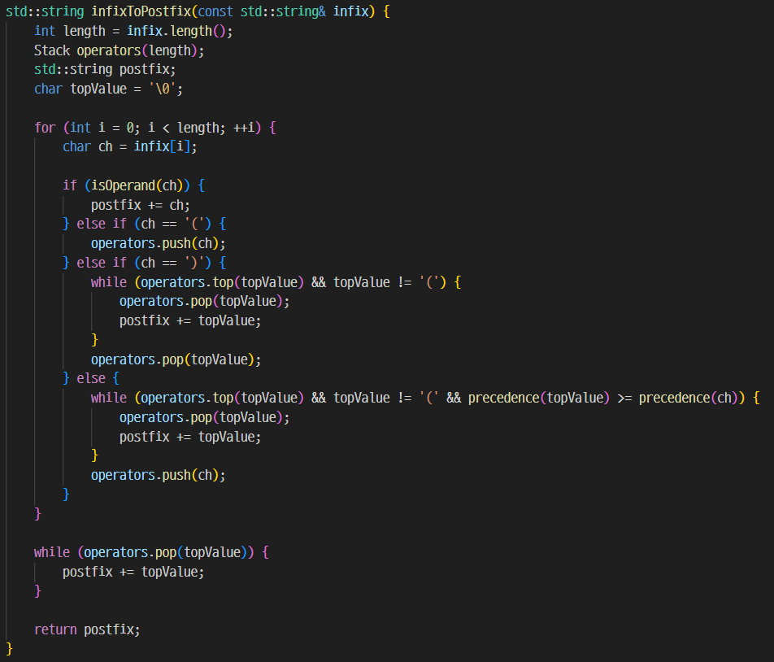

# 보고서 초안

## Problem 1

## Problem 2

## Problem 3

원형 큐를 구현하기 전 어떤 메서드가 필요할지 고민하였다.

Queue의 핵심 기능인 enqueue, dequeue가 필요할 것이고 가장 앞에 있는 값을 읽을 front가 필요할 것이다.
그리고 Queue의 상태를 확인하기 위해 empty, full, size, capacity 메서드도 필요할 것이다.
마지막으로 Queue의 생성자와 소멸자, clear 메서드까지 있다면 충분히 쓸만한 큐가 될 것이다.


원형 큐를 구성하기 위한 최소한의 맴버 변수를 사용하였다.


full 상태일 때 배열의 1칸이 비기 때문에 Queue 크기를 _capacity에 맞추기 위해 _capacity+1 크기의 배열을 _data에 선언하였다.


_data 배열의 크기가 _capacity+1 이기 때문에 모듈러 연산에 _capacity+1을 사용하였다.

queuetest.cpp 코드를 작성해 _capacity가 20인 Queue에 20개 알파멧으로 enqueue, dequeue 테스트를 수행하여 정상 동작함을 확인하였다.

## Problem 4

## Problem 5

`((1+2)*(3-4))/5` 형태의 Infix 수식을 `12+34-*5/` 형태의 Postfix로 변환해야 한다.

수식은 `0~9`의 피연산자와 `+-*/`의 연산자 `()`의 괄호로 이루어져 있다.

변환을 위해 String의 각 index의 요소를 하나의 token으로 다루었다.

토큰의 연산자, 피연산자 구분을 위해 isOperand 함수와 isOperator 함수를 구성하였다.

또한 연산자의 우선순위를 파악하기 위해 precedence 함수를 구성하여 `+-`의 경우 1을 `*/`의 경우 2를 반환하도록 구성하였다.



infix String의 각 index를 순회하며 각 index의 값을 ch에 저장한다.

ch가 피연산자일 경우 postfix에 값을 추가한다.

ch가 `(`일 경우 stack에 push한다.

ch가 `)`일 경우 `(`가 나오기 전까지의 연산자를 stack에서 pop하여 순서대로 postfix에 추가한다.

ch가 연산자일 경우 ch보다 우선순위가 낮은 연산자 또는 `(`가 나오기 전까지 stack 에서 연산자를 꺼내 postfix에 추가한 뒤 ch를 stack에 추가한다.

String 을 모두 순회하면 stack에 남은 연산자를 순서대로 꺼내어 postfix에 추가한다.

```
1+2 -> 12+
1+2*3 -> 123*+
(1+2)*3 -> 12+3*
1*(2+3)-4/5 -> 123+*45/-
((1+2)*(3-4))/5 -> 12+34-*5/
```

위와 같은 테스트 결과를 얻을 수 있었다.

위 버전은 하나의 문자를 토큰으로 다루기 대문에 2자리 수 이상의 숫자를 처리할 수 없다.
이 문제를 해결하기 위해 2글자 이상을 하나의 토큰으로 다루도록 코드를 수정할 수 있다.