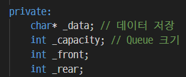
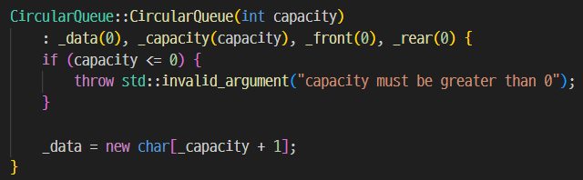
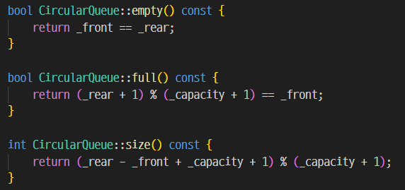

# 보고서 초안

## Problem 1

## Problem 2

## Problem 3

원형 큐를 구현하기 전 어떤 메서드가 필요할지 고민하였다.

Queue의 핵심 기능인 enqueue, dequeue가 필요할 것이고 가장 앞에 있는 값을 읽을 front가 필요할 것이다.
그리고 Queue의 상태를 확인하기 위해 empty, full, size, capacity 메서드도 필요할 것이다.
마지막으로 Queue의 생성자와 소멸자, clear 메서드까지 있다면 충분히 쓸만한 큐가 될 것이다.

원형 큐를 구성하기 위한 최소한의 맴버 변수를 사용하였다.

full 상태일 때 배열의 1칸이 비기 때문에 Queue 크기를 _capacity에 맞추기 위해 _capacity+1 크기의 배열을 _data에 선언하였다.

_data 배열의 크기가 _capacity+1 이기 때문에 모듈러 연산에 _capacity+1을 사용하였다.

queuetest.cpp 코드를 작성해 _capacity가 20인 Queue에 20개 알파멧으로 enqueue, dequeue 테스트를 수행하여 정상 동작함을 확인하였다.

## Problem 4

## Problem 5
