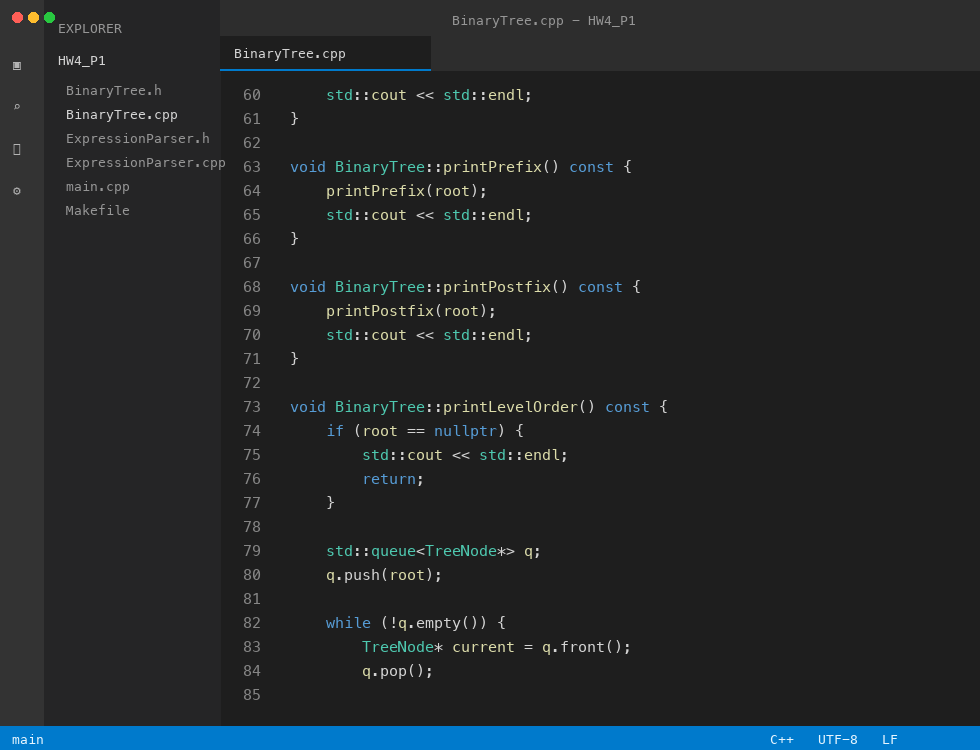
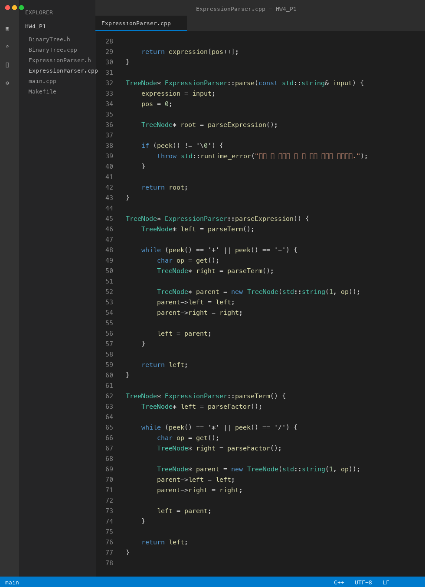
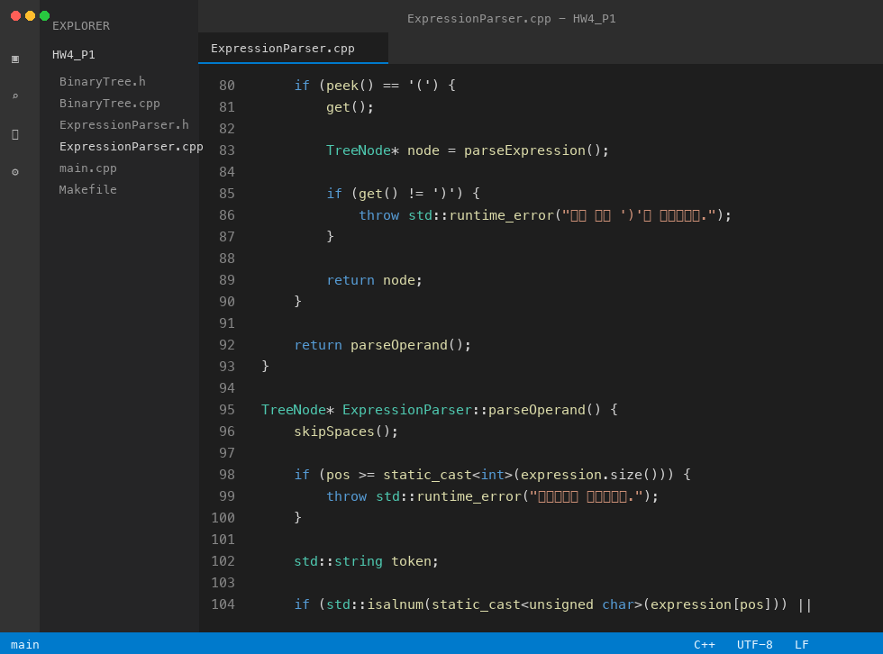

# 보고서 초안

## Problem 1

연산자 우선순위를 반영하는 산술식을 이진트리로 만드는 프로그램을 작성하였다.

입력받은 Infix 수식을 분석하여 연산자는 부모 노드, 피연산자는 자식 노드가 되도록 트리를 구성하였다.

이진트리는 `TreeNode` 구조체와 `BinaryTree` 클래스를 이용하여 표현하였다.


`BinaryTree` 클래스에는 Infix, Prefix, Postfix 순회 함수가 구현되어 있다.

Infix 출력에서는 연산자 노드에 괄호를 붙여 계산 순서가 유지되도록 하였다.


Level order 출력은 queue를 이용하여 루트부터 같은 깊이의 노드를 차례대로 방문하도록 구현하였다.



수식 파싱은 `ExpressionParser` 클래스에서 처리하였다.

`+`, `-`는 expression 단계에서 처리하고, `*`, `/`는 term 단계에서 처리하여 연산자 우선순위가 반영되도록 하였다.

괄호가 나오면 괄호 안의 수식을 먼저 파싱하여 우선순위를 바꾸도록 구현하였다.



피연산자는 문자, 숫자, `_`, `.`을 포함할 수 있도록 처리하였다.

잘못된 피연산자나 닫는 괄호가 없는 경우에는 예외를 발생시킨다.



실행 흐름

사용자가 산술식을 입력한다.

`ExpressionParser`가 입력 문자열을 분석하여 이진트리의 root 노드를 만든다.

생성된 root를 `BinaryTree` 객체에 넣고 Infix order 결과를 출력한다.


실행 예시

```
입력: ((a+b)*c-d)/(e+f)
출력: ((((a+b)*c)-d)/(e+f))
```

위 결과처럼 입력된 산술식이 이진트리로 구성된 뒤 Infix order로 다시 출력되는 것을 확인할 수 있다.

현재 코드에는 Prefix, Postfix, Level order 출력 함수도 구현되어 있으므로 `main.cpp`에서 해당 함수들을 추가로 호출하면 네 가지 방문 결과를 모두 확인할 수 있다.

개선점

현재 파서는 `+`, `-`, `*`, `/`, 괄호 중심의 기본 산술식을 처리한다.

추후 거듭제곱 연산자나 단항 음수까지 처리하도록 확장할 수 있다.

또한 과제 조건을 더 잘 만족하려면 5개 이상의 산술식을 테스트하고, Infix, Prefix, Postfix, Level order 결과를 모두 출력하도록 main 함수를 확장할 수 있다.
